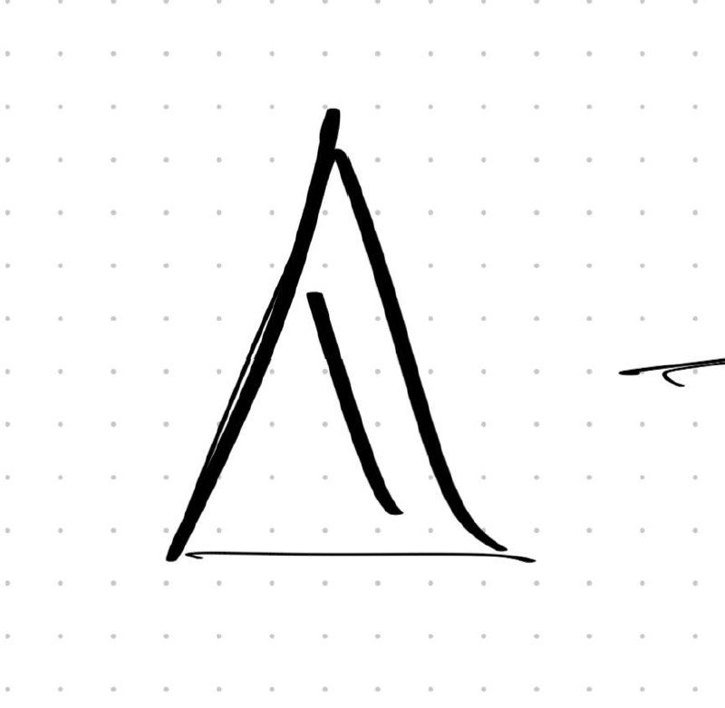

# Руна Формы

> **Тип:** Структурная руна — определяет вместимость и траекторию  
> **Статус:** Ключевая компонента системы



---

## Описание

Руна Формы отвечает за **структуру высвобождения** магии — как энергия будет доставлена к цели, в какой конкретной форме она проявится.

### Функция как ёмкость
Руна действует как **сосуд** или **форма-литейная**, которая:
- Содержит энергию от Руны Силы
- Придаёт ей геометрическую структуру
- Определяет траекторию движения к цели

---

## Принцип работы

### Каскад рун
```
Мана → Руна Силы → Руна Формы → Конкретная магия
       [Энергия]   [Структура]   [Результат]
```

### Пример: Огненный шар
| Этап | Руна | Действие |
|------|------|----------|
| 1 | Силы | Наполняет огненной энергией |
| 2 | Формы | Придаёт форму сферы, определяет полёт |
| 3 | — | Огненный шар летит к цели |

### Возможные формы
- **Сфера** — шар, взрыв, шаровая молния
- **Луч** — прямой, концентрированный
- **Волна** — конус, расширяющееся воздействие
- **Стена** — барьер, щит, препятствие
- **Поток** — непрерывный, например пламя

---

## Игровая механика

### Комбинаторика с Руной Силы
Игрок комбинирует:
1. **Выбирает стихию** через Руну Силы (огонь, вода...)
2. **Выбирает форму** через Руну Формы (шар, луч, волна...)
3. **Получает уникальное заклинание**

### Примеры комбинаций
| Сила | Форма | Результат |
|------|-------|-----------|
| 🔥 Огонь | Сфера | Огненный шар |
| 🔥 Огонь | Луч | Пламя, выжигающее линию |
| 🔥 Огонь | Волна | Волна пламени (огнемёт) |
| 💧 Вода | Сфера | Водяной снаряд |
| 💧 Вода | Стена | Ледяная стена |
| 🌪️ Воздух | Луч | Ударный воздушный луч |
| 🌪️ Воздух | Волна | Взрывная волна |

### Редактор способностей
В редакторе игрок может:
- Задать пропорцию Сила : Форма
- Добавить модификаторы формы (отскок, проникновение, замедление)
- Создать цепочку: одна форма → другая (например, луч взрывается волной)

---

## Символика

Визуал — **треугольник с внутренней линией**:
- Внешний контур — границы формы, ёмкость
- Внутренняя линия — направление, фокус, траектория
- Символизирует: контейнер для силы, воронка для энергии

> *"Сила без формы — лишь хаос. Форма без силы — лишь пустота."*

---

## Связи

### Вход
- [[Руна Силы]] — источник энергии

### Выход
- Руны-триггеры (запускающие эффект)
- Руны-модификаторы (добавляющие свойства)

### Использование в Авроре
Маги Авроры разработали **продвинутые формы**, недоступные обычным магам — возможно, связь с цветовыми/временными искажениями внутри купола?

---

## Открытые вопросы
- [ ] Может ли одна Руна Формы содержать несколько стихий одновременно?
- [ ] Есть ли предел "вместимости" формы (перегруз = взрыв?)
- [ ] Могут ли формы быть живыми/разумными (големы)?

---
*Создано:* 2026-01-31  
*Связано:* [[Руна Силы]], [[Редактор способностей]], [[4 фазы атаки]]
