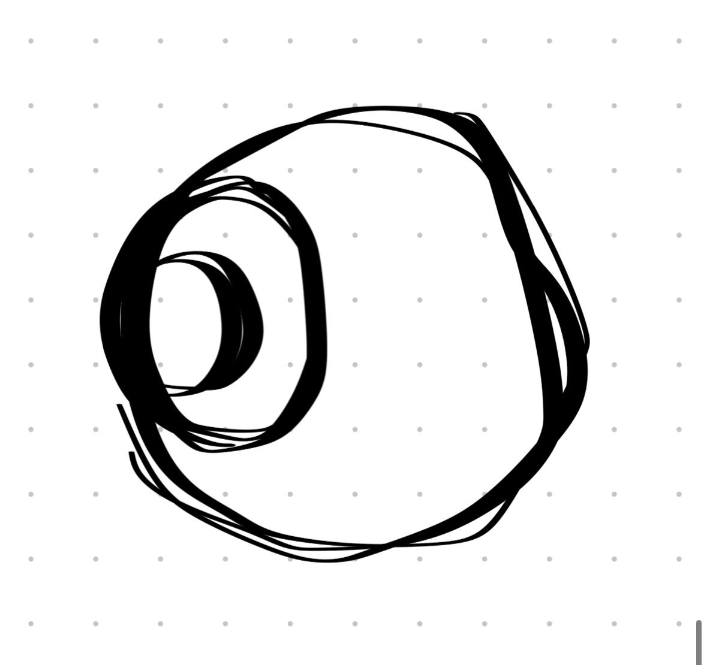

# Руна Гравитации

> **Тип:** Навигационная руна — направление и притяжение  
> **Статус:** Завершающий элемент триады



---

## Описание

Руна Гравитации отвечает за **направление** и **притяжение** магии к цели. Она задаёт вектор движения и может создавать "магическое притяжение" — аналог гравитации для заклинаний.

### Двойная функция
1. **Притяжение** — заклинание "притягивается" к цели (homing, самонаведение)
2. **Направление** — задаёт чёткий вектор движения с гравитационной силой

---

## Полная система каскада

```
┌─────────────┐    ┌─────────────┐    ┌─────────────────┐
│ Руна Силы   │ →  │ Руна Формы  │ →  │ Руна Гравитации │
│ [Что]       │    │ [Как]       │    │ [Куда]          │
│ Энергия     │    │ Структура   │    │ Направление     │
│ Стихия      │    │ Ёмкость     │    │ Притяжение      │
└─────────────┘    └─────────────┘    └─────────────────┘
       ↓                   ↓                   ↓
   Огненная мана    Форма сферы        Полёт к цели
```

### Пример: Огненный шар с самонаведением
| Этап | Руна | Функция |
|------|------|---------|
| 1 | Силы | Огненная энергия |
| 2 | Формы | Сферическая ёмкость |
| 3 | Гравитации | Притяжение к цели, преследование |

---

## Игровая механика

### Модификаторы гравитации
- **Прямой полёт** — быстро, прямо, легко увернуться
- **Притяжение (Слабое)** — полукруговой полёт, постепенно изгибается к цели
- **Притяжение (Сильное)** — резкий вираж, мощное самонаведение
- **Орбита** — заклинание вращается вокруг цели перед ударом
- **Вспомогательное поле** — изменяет гравитацию в радиусе (подтягивает/отталкивает)

### Расход маны
| Тип гравитации | Множитель маны | Точность |
|----------------|----------------|----------|
| Прямой полёт | 1.0x | Требует прицеливания |
| Слабое притяжение | 1.3x | Умеренное самонаведение |
| Сильное притяжение | 1.8x | Высокое самонаведение |
| Орбита | 2.0x | Обходит препятствия |

### Комбинации с формами
| Форма + Гравитация | Эффект |
|---------------------|--------|
| Сфера + Притяжение | Преследующий огненный шар |
| Луч + Направление | Сверхточный лазерный луч |
| Волна + Орбита | Круговой удар с вращением |
| Стена + Вспомог. поле | Гравитационный барьер (втягивает врагов) |

---

## Символика

Визуал — **спираль внутри круга**:
- **Внешний круг** — область влияния гравитации
- **Спираль** — направление, вихрь, притяжение к центру
- **Символизирует:** сила, притягивающая всё к центру — будь то цель или точка в пространстве

> *"Не важно, как сильна твоя магия, если она не достигает цели."*

---

## Связи

### Вход
- [[Руна Формы]] — получает структурированную ману
- Без Формы гравитация не удерживает энергию

### Выход
- Цель заклинания (враг, объект, точка в пространстве)
- Дальнейшие руны-модификаторы (триггеры при попадании)

### Особенность Авроры
Внутри купола Авроры **гравитация работает иначе** — маги используют это для "полёта" (70% передвижений). Возможно, Руна Гравитации в Авроре даёт доступ к уникальным эффектам:
- **Инверсия гравитации** — отталкивание вместо притяжения
- **Нулевая гравитация** — парящие заклинания
- **Переменная гравитация** — меняет направление mid-flight

---

## Открытые вопросы
- [ ] Может ли гравитация "перетянуть" заклинание с одной цели на другую?
- [ ] Что если цель использует анти-гравитацию?
- [ ] Есть ли предел дальности притяжения?

---
*Создано:* 2026-01-31  
*Связано:* [[Руна Силы]], [[Руна Формы]], [[Аврора — гравитационные аномалии]]
