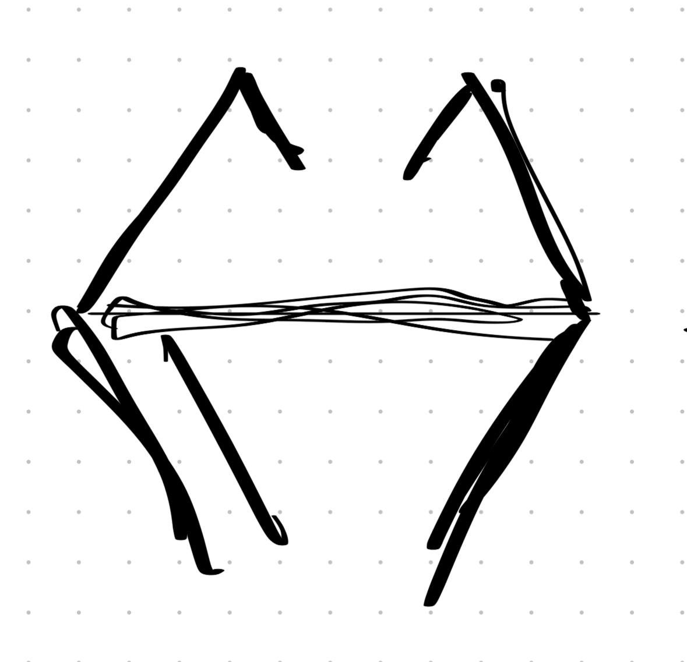

# Руна Силы

> **Тип:** Корневая руна — проводник всех стихий  
> **Статус:** Фундаментальная



---

## Описание

Руна Силы — это **универсальный проводник** через который проходят все стихийные и физические проявления маны. Она служит базовым каналом для трансформации энергии в конкретные эффекты.

### Проходящие через руну элементы:
- 🔥 **Огонь** — разрушение, тепло, свет
- 💧 **Вода** — текучесть, исцеление, адаптация
- 🌪️ **Воздух** — скорость, звук, невидимость
- 🪨 **Земля** — защита, устойчивость, рост
- ✨ **Прочие физические явления** — электричество, лёд, магнетизм

---

## Функция магической системы

### Роль
Руна Силы выступает как **интерфейс** между чистой маной и её применением. Без неё мана остаётся неструктурированной энергией.

### Принцип работы
```
Чистая мана → Руна Силы → [Стихийная настройка] → Конкретный эффект
```

### Связи с другими рунами
- **Вход:** Принимает ману от источника (Ковчег, кристаллы, маг)
- **Выход:** Передаётся в [[Руна Формы]] → далее в руны-специализации

**Каскад:** Мана → [[Руна Силы]] → [[Руна Формы]] → [[Руна Гравитации]] → Эффект

---

## Игровая механика

### Использование в боевой системе
- **Базовая руна** для всех элементальных атак
- Усиливается **4 фазами атаки** (триггер → скапливание → всплеск → попадание)
- Через неё работает **редактор способностей**

### Кастомизация
Игрок может модифицировать:
- Пропорции стихий в одной атаке
- Интенсивность эффекта
- Дополнительные свойства (горение, заморозка, отравление)

---

## Символика

Визуально руна представляет собой **пересечение потоков**:
- Верхняя часть — расходящиеся лучи (потенциал, возможности)
- Центральная линия — концентрация, фокус
- Нижняя часть — расходящиеся струи (реализация, проявление)

> *"Сила не в энергии, а в её направлении."* — Маги Авроры

---

## Локации / Источники
- [ ] Храмы Авроры (центральный и 4 спутника)
- [ ] Артефакты древней цивилизации
- [ ] Учебники магов Ботаджи

---
*Создано:* 2026-01-31  
*Связано:* [[Система магии]], [[4 фазы атаки]], [[Аврора]]
