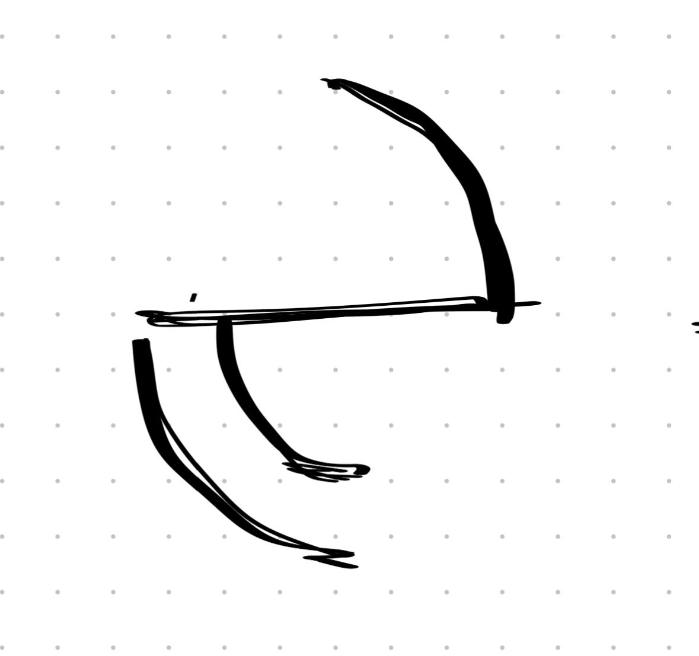

# Руна Души

> **Тип:** Мета-руна — доступ к духовному уровню  
> **Статус:** Особая, работает с душей

---

## Описание

Руна Души — единственная руна, работающая не с физической маной, а с **духовным уровнем существа**. Она предоставляет доступ к душе и позволяет направлять магию внутрь себя или влиять на души других.

### Двойное применение
1. **На себя** — самоисцеление, восстановление души, защита сознания
2. **На других** — воздействие на духовное состояние врага или союзника

---

## Функции

### 1. Исцеление души
- Восстановление "духовного здоровья" (отдельная шкала от физического HP)
- Снятие ментальных Debuff'ов (страх, безумие, контроль разума)
- Защита от воздействия Скверны на психику

### 2. Воздействие на другие души
- **Паралич духа** — цель не может использовать магию
- **Очищение** — снятие негативных эффектов с союзника
- **Чтение намерений** — понимание истинных целей цели
- **Связь душ** — телепатическая коммуникация

### 3. Уникальная механика: Тема игры
Связана с **центральной темой** Magic Awakening:
> *"Игнорирование собственной сути ведёт к краху"*

Руна Души позволяет:
- **Принять свою суть** — усиление способностей при принятии
- **Сопротивляться** — риск безумия от Скверны
- **Искать истину** — Тео использует её для понимания своей связи с отцом

---

## Игровая механика

### Шкала Души
| Состояние | Эффект |
|-----------|--------|
| 100-75% | Полная эффективность магии |
| 74-50% | Снижение маны, лёгкие галлюцинации |
| 49-25% | Сильные помехи, риск безумия |
| 24-0% | Кататония / потеря контроля персонажем |

### Воздействие Скверны на душу
- Скверна не просто ранит — она **разъедает идентичность**
- Руна Души — единственная защита от "потери себя"
- **Ключевой конфликт:** Тео должен использовать руну, чтобы сохранить свою сущность в контакте со Скверной

### Комбинации с другими рунами
| Базовые руны + Душа | Эффект |
|---------------------|--------|
| Сила + Форма + Душа | Физическая атака + урон духу |
| Душа + Форма | Щит души (барьер для духовной защиты) |
| Душа + Гравитация | Притяжение душ (вытягивание энергии из врага) |
| Душа (соло) | Самоанализ, восстановление, медитация |

---

## Символика

Визуал — **лук с натянутой тетивой**:
- **Лук** — дуга бытия, континуум души
- **Тетива** — связь между физическим и духовным
- **Натяжение** — потенциал, готовность к действию
- **Направление** — внутрь себя или вовне к другому

> *"Лук натянут — стрела полетит к цели или к стрелку? В этом выбор сущности."*

---

## Связи с лором

### Тео и его отец
Отец, находясь в Авроре, мог использовать **продвинутые техники Руны Души** для сохранения разума внутри купола. Это объясняет, почему он ещё жив и сопротивляется Скверне.

### Три мага-создателя Авроры
Их души **связаны с куполом** — возможно, использовали Руну Души для слияния своей жизненной силы с магией ковчега.

### Артефакт миссии Тео
Возможно, артефакт — это **кристаллизованная Руна Души** огромной мощи, способная защитить/очистить/поглотить множество душ. Это объясняет интерес Ботаджи.

### Безумие от Скверны
Теория: Скверна — это **дисконнект души от тела**, разрыв связи. Руна Души восстанавливает эту связь.

---

## Механика редактора

Игрок может создавать:
- **Заклинания самоисцеления** — восстановление шкалы Души
- **Атаки по духу** — игнорируют физическую защиту, бьют по "Совести"
- **Защитные обереги** — иммунитет к контролю разума
- **Связи с напарниками** — разделение урона по душе

**Ограничение:** Использование Руны Души **расходует собственную душу** (временное снижение максимума шкалы до отдыха/медитации).

> Риск: Слишком частое применение приближает к "краху сути" — теме игры.

---

## Открытые вопросы
- [ ] Можно ли "украсть" душу через эту руну?
- [ ] Есть ли нежить — существа без души, неуязвимые к этой руне?
- [ ] Связана ли Руна Души с 7 Голубыми планетами (души планет?)

---
*Создано:* 2026-01-31  
*Связано:* [[Руна Силы]], [[Руна Формы]], [[Руна Гравитации]], [[Тео — отец]], [[Скверна]]
